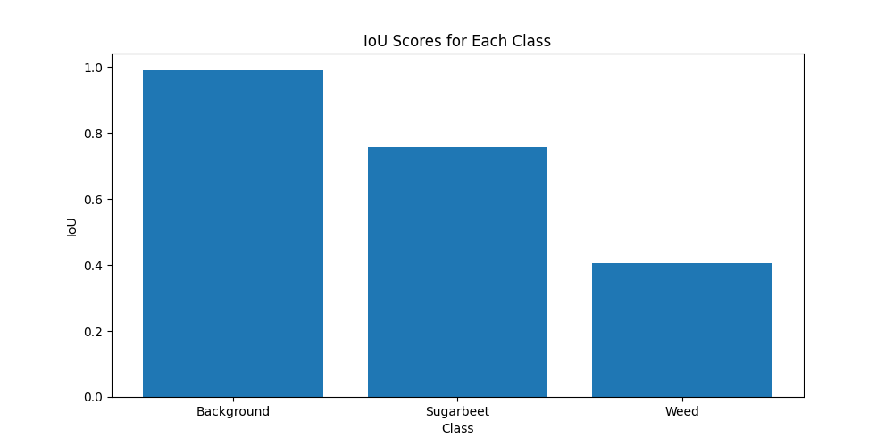
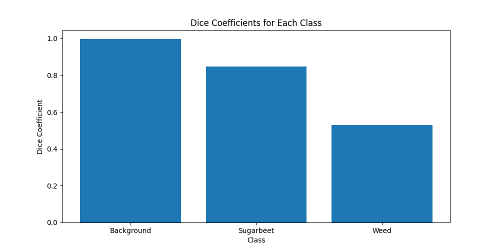
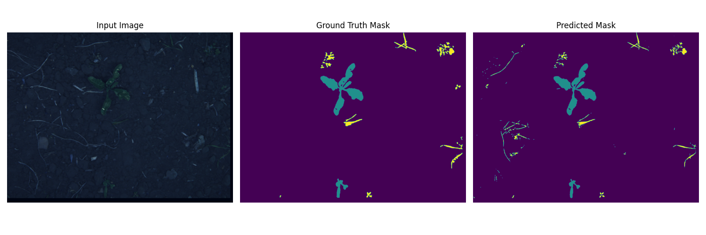
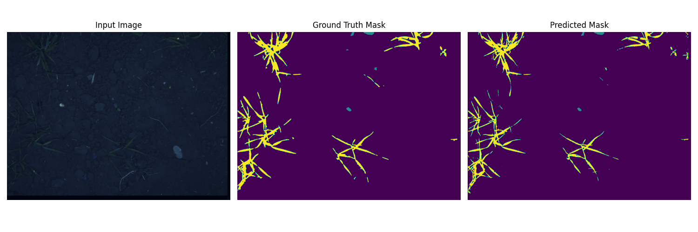
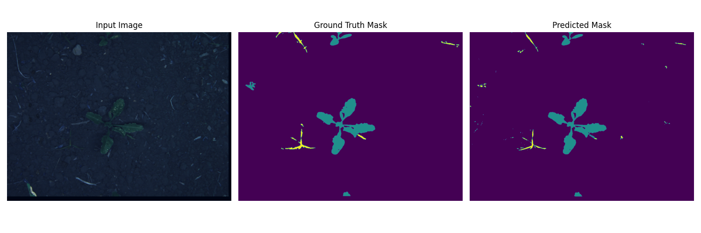

# Early Detection of Weeds in Sugar Beet Fields Using Machine Learning

**Pixel-wise segmentation of RGB+NIR sugar beet field images using deep learning (U-Net + ResNet-34) for precision weed detection.**

---

## Table of Contents

- [Overview](#overview)
- [Dataset](#dataset)
- [Model Architecture](#model-architecture)
- [How to Run](#how-to-run)
- [Results](#results)
- [Project Structure](#project-structure)
- [Credits](#credits)
- [References](#references)

---

## Overview

This project implements a deep learning pipeline for automatic segmentation of weeds and sugar beet plants from RGB + Near-Infrared (NIR) field images. The core model is a U-Net architecture with a ResNet-34 encoder, trained and evaluated on the [Sugar Beets 2016 dataset](https://www.ipb.uni-bonn.de/data/sugarbeets2016/).

**Key Features:**
- Handles 4-channel input (RGB + NIR)
- Pixel-wise classification: background, sugarbeet, weed
- Model: U-Net + ResNet-34 encoder (ImageNet pretrained)
- Complete pipeline: training, visualization, evaluation with advanced metrics (IoU, Dice, Cohen’s κ, precision, recall)

---

## Dataset

- **Source:** [Sugar Beets 2016 (SB16)](https://www.ipb.uni-bonn.de/data/sugarbeets2016/)
- **Structure:**
    ```
    data/
      ├── rgb/
      ├── nir/
      └── annotations/
    ```
    Each folder contains `.png` files; all images are resized to **1312×1312** pixels.

- **Classes:**  
    - `0`: Background (black in mask)  
    - `1`: Sugarbeet (blue in mask)  
    - `2`: Weed (red in mask)  

*Dataset is not included in this repo. Please download and prepare as described above.*

---

## Model Architecture

- **Network:** U-Net with ResNet-34 encoder (pretrained on ImageNet)
- **Input:** 4-channel images (RGB + NIR)
- **Output:** 3-class segmentation mask
- **Loss:** CrossEntropyLoss
- **Optimizer:** Adam (`lr=1e-4`)
- **Augmentation (train):** Horizontal flip, brightness/contrast, Gaussian blur, normalization (using Albumentations)

---

## How to Run

1. **Install dependencies:**
    ```bash
    pip install -r requirements.txt
    ```

2. **Prepare dataset:**  
   Download the Sugar Beets 2016 dataset and organize as shown above.

3. **Train the model:**
    ```bash
    python train.py
    ```
    - Saves best model as `output/best_model.pth`
    - Plots training/validation loss convergence (`output/convergence_graph.png`)

4. **Run inference and visualize predictions:**
    ```bash
    python inference_visualize.py
    ```
    - Generates predicted masks and comparison images in `output/`
    - Plots and saves per-class IoU and Dice graphs

5. **Evaluate advanced metrics:**
    ```bash
    python evaluate_metrics.py
    ```
    - Calculates Cohen’s kappa, per-class precision/recall
    - Saves results to `output/evaluation_metrics.txt`

---
## Results

| Class       | IoU (%) | Dice (%) | Precision (%) | Recall (%) |
|-------------|---------|----------|---------------|------------|
| Background  | 99.44   | 99.72    | 99.72         | 99.86      |
| Sugarbeet   | 89.78   | 94.13    | 98.67         | 94.50      |
| Weed        | 63.78   | 77.61    | 71.95         | 85.64      |

- **Cohen’s κ coefficient:** 0.8959

---

### Quantitative Results

- **IoU scores:**  
  
- **Dice coefficients:**  
  

---

### Qualitative Results

Sample predictions (Input | Ground Truth | Predicted):

| Example 1 | Example 2 | Example 3 |
|-----------|-----------|-----------|
|  |  |  |

<!-- Add more examples if you like: just copy-paste more columns! -->

---

### Study Comparison

#### **Performance Across Studies**

| Study                       | Architecture         | Dataset            | IoU/Accuracy (%) | Key Features/Limitations                          |
|-----------------------------|----------------------|--------------------|------------------|---------------------------------------------------|
| **This Study**              | ResNet-34 + U-Net    | SB16 (RGB + NIR)   | IoU: **93.5**    | Efficient 4-channel pixel-wise segmentation        |
| Zou et al. (2021) [9]       | Modified U-Net       | Field Dataset      | IoU: 92.91       | Robust data augmentation, simplified U-Net         |
| You et al. (2020) [11]      | ResNet-50 + HDC      | Stuttgart, Bonn    | IoU: 89.01       | Attention, multi-scale features                    |
| Bosilj et al. (2019) [3]    | SegNet (Transfer L.) | Carrot, Onion      | IoU: 85          | Transfer learning, 80% less training time          |

#### **Architectural Comparison**

| Study                   | Encoder Backbone      | Key Enhancements                      | Computational Efficiency      |
|-------------------------|----------------------|---------------------------------------|------------------------------|
| **This Study**          | ResNet-34            | Pretrained, skip connections          | Moderate (4-channel input)   |
| Zou et al. (2021) [9]   | Simplified U-Net     | Augmentation, two-stage training      | High                         |
| You et al. (2020) [11]  | ResNet-50            | Attention, HDC, SPRB                  | Low (more components)        |
| Bosilj et al. (2019) [3]| SegNet               | Transfer learning                     | High                         |

---

### Additional Outputs

- `beet_weed_predict.err` / `beet_weed_train.out` — logs from training/inference

---

**These results demonstrate that the ResNet-34 + U-Net model provides state-of-the-art performance for weed detection in precision agriculture, especially in terms of overall segmentation accuracy and real-time applicability.**
